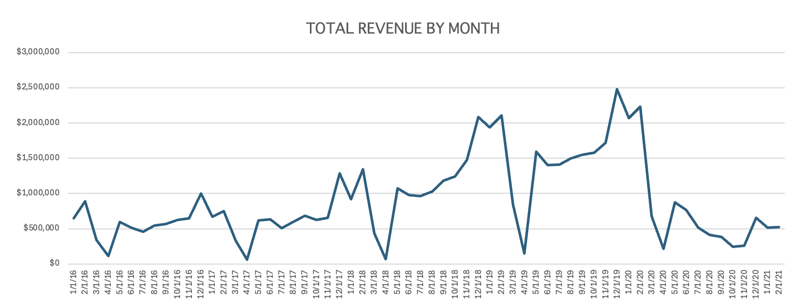
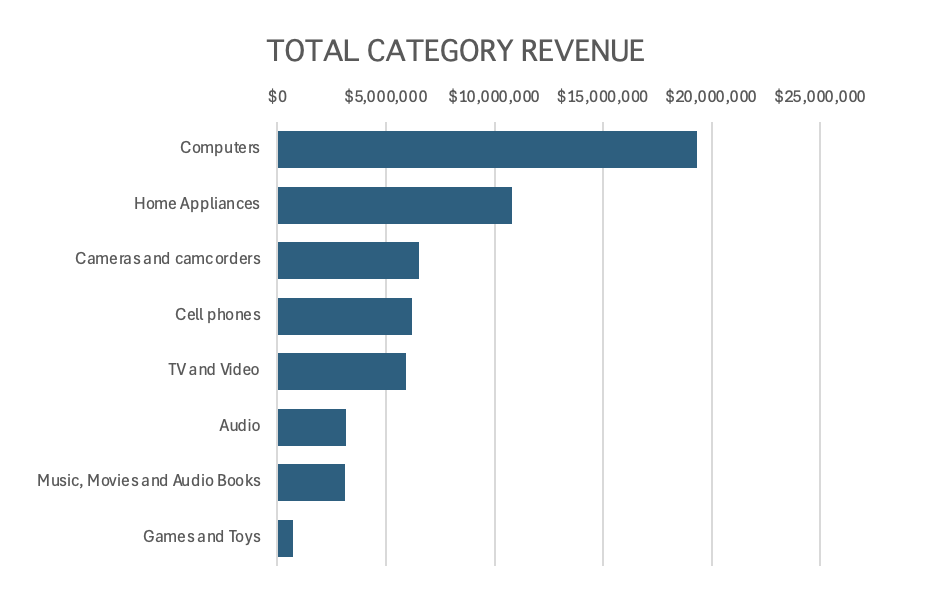
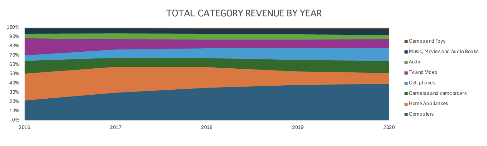
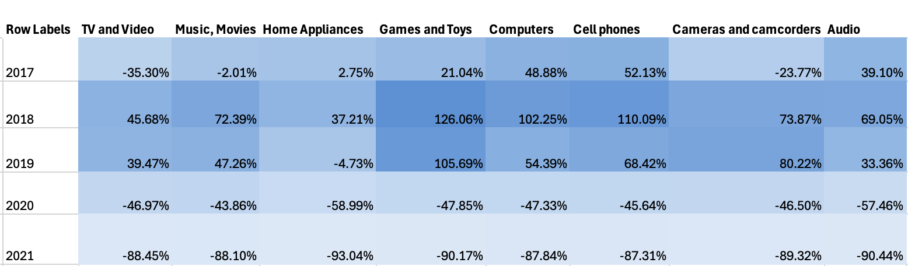
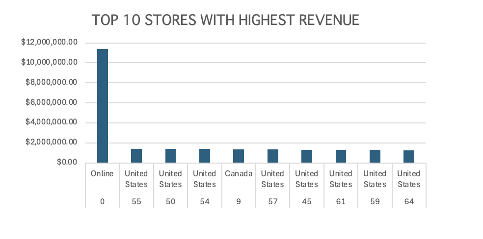

# Global Electronics Retailer Sales Analysis (Excel Project)

## Objective
The goal of this project was to analyze historical sales data from a global electronics retailer to uncover trends, identify performance patterns, and highlight areas of growth and decline across product categories and store types.

Tools Used:

- Microsoft Excel

- Pivot Tables and Pivot Charts

- Data Cleaning and Formatting

- Trend Analysis and Visualization

## Executive Summmary

## Data Structure and Overview

This dataset represents a relational retail database designed to capture detailed information about customers, stores, products, sales transactions, and currency exchange rates for a global electronics retailer.

The sales table is the central fact table, recording each customer purchase with order details, product information, quantities, currencies, and associated store locations. It connects to supporting dimension tables through foreign keys:

- The customers table stores demographic and geographic information such as name, gender, city, state, country, and continent, enabling customer segmentation and regional sales analysis.

- The stores table identifies retail locations where sales occur, including country, state, store size, and opening date, supporting analyses of store performance and geographic expansion.

- The products table contains detailed product attributes such as brand, color, category, unit cost, and unit price, allowing profitability, product mix, and inventory analysis.

- The exchange_rates table records daily conversion rates for multiple currencies, providing a mechanism to normalize global sales figures to a common base currency for accurate financial reporting.

Together, these linked tables form a star-schema-like structure, with sales serving as the central hub connecting customer, product, store, and currency data. This schema supports comprehensive retail analytics — such as tracking revenue trends, evaluating store and product performance, monitoring international operations, and understanding customer purchasing behavior across regions.

## Insights

**Revenue Trends:** Overall revenue showed a steady increase year over year until 2020, when there was a noticeable drop, likely linked to external market factors.

**Seasonal Patterns:** Significant revenue dips consistently occurred in April each year, suggesting a recurring seasonal slowdown in sales.

**Category Performance:** The Computers category generated the highest revenue across all years. While early on, the gap between Computers and the next top category was small, this gap has steadily widened, indicating growing dominance in that category.

**Store Type Analysis:** The online store consistently outperformed physical store locations, bringing in significantly more revenue.

**Sales Growth by Category:** Computers showed the greatest increase in sales up until 2019, reinforcing the category’s strong upward momentum prior to the 2020 revenue decline.

## Recommendations
